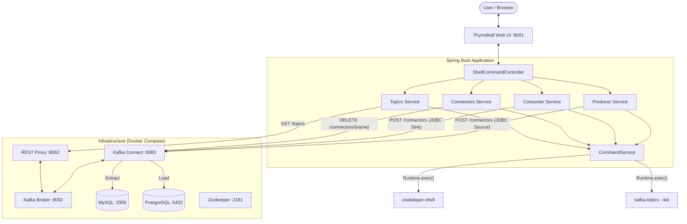

# Technical Application Analysis (Source & Config Only)

This analysis is derived strictly from the Java source code, `application.properties`, and `docker-compose.yml`, ignoring the `README.md`.

## System Architecture

The application acts as a management layer for a Confluent-based data ecosystem. It coordinates data movement between MySQL and PostgreSQL via Kafka.

## Key Components

### 1. Management Services
- **Producer & Consumer Services**: Programmatically generate JSON configurations for Kafka Connect. They use the `JdbcSourceConnector` and `JdbcSinkConnector` classes specified in `application.properties`.
- **Connectors Service**: Provides bulk operations like "Delete All" and "Reset Topics" for all active Kafka Connectors.
- **Topics Service**: Interfaces with the `rest-proxy` container to list non-internal Kafka topics.

### 2. Infrastructure Integration
- **Kafka Connect (`connect` container)**: The central engine for data movement. It is loaded with custom JDBC drivers provided via the `./db-jars` volume.
- **Databases**: 
    - **MySQL**: The data source, initialized with scripts from `./scripts/db`.
    - **PostgreSQL**: The data sink.
- **Direct CLI Execution**: The `CommandService` uses `ProcessBuilder` to run local binaries (e.g., `/usr/bin/kafka-topics`) for cluster diagnostics, as defined in the properties file.

## Data Pipeline Flow
1. **Source**: Data is extracted from **MySQL** by a JDBC Source Connector.
2. **Transit**: Data is produced into **Kafka Topics**.
3. **Sink**: A JDBC Sink Connector consumes data from Kafka and inserts it into **PostgreSQL**.
4. **Management**: The Spring Boot app monitors and configures this entire lifecycle.
